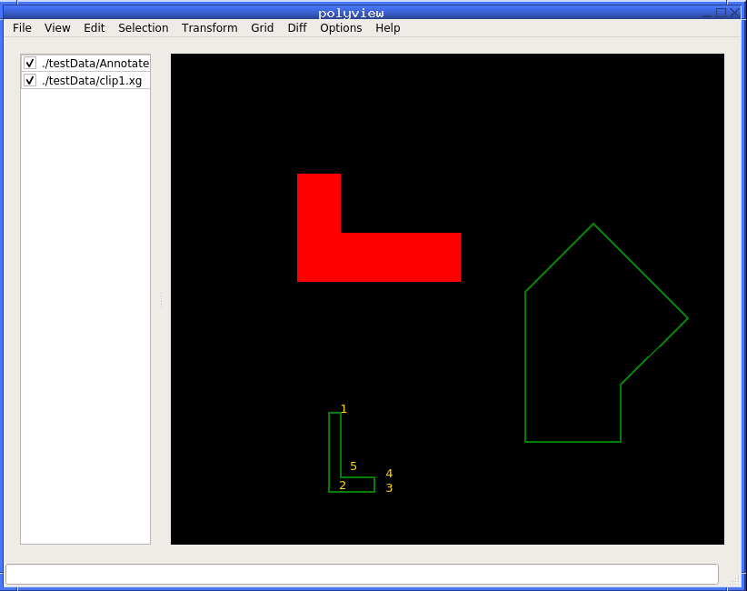

<p align="center" width="100%">
     
</p>

PolyView is a free and open source cross-platform program designed to
quickly load, view, and edit multiple files containing polygons. It
can zoom and pan, show polygons as edges, points, and filled, display
text labels, print the coordinates of vertices and measure distances,
change the order in which polygons are displayed, choose which
polygons to show, etc.

PolyView can add, delete, move, and transform polygons, vertices,
edges, and text labels. It can also cut polygons to a box.

This program can overlay images and polygons, if each image has a
plain-text metadata file describing how to place the image relative to
the polygons.

These features are documented in detail further down this document.

# Installation

This software is available for Linux, OSX, and Microsoft Windows. It
can be installed in user's home directory using ``conda``, with 
no administrative rights. 

First install ``conda`` from:

    https://docs.conda.io/en/latest/miniconda.html

On Linux and OSX, make the fetched installation file executable and
run it, such as:

    chmod u+x ./Miniconda3-latest-Linux-x86_64.sh
    ./Miniconda3-latest-Linux-x86_64.sh

Use the suggested:

    $HOME/miniconda3

directory for installation. If prompted to set up your shell and
restart it, do so.

On Windows, run the installer by double-clicking on it. When finished,
launch the "Anaconda PowerShell Prompt" from the "Start" menu.

Install PolyView on all platforms as:

    conda create -c oleg-alexandrov -c conda-forge -n polyview polyview=1.0

This will take a while to run and will download Qt and other
supporting libraries.

This program will be installed for Linux and OSX in:

    $HOME/miniconda3/envs/polyview/bin/polyview

and can be run with this command. On Windows, first set in the
Anaconda PowerShell the value:

     $Env:QT_PLUGIN_PATH = "C:\Users\UserName\Miniconda3\envs\polyview\Library\plugins"

and then run it from that shell as:

    C:\Users\UserName\Miniconda3\envs\polyview\bin\polyview.exe

Replace ``UserName`` and the drive letter with specific values for your machine. 

See instructions further down for how to compile PolyView.

# License

PolyView is available under the MIT license and can be used for any
purpose, academic or commercial.

# Comparison with XGRAPH

PolyView was inspired by XGRAPH (http://www.xgraph.org/). The latter
is a general purpose data plotter and has a lot of features PolyView
lacks. PolyView has extra features for viewing and editing polygons.

PolyView is (as of 2007) more responsive for polygons with very many
vertices, and it can handle zooming to small regions of polygons with
large floating point vertex coordinates without overflowing and
showing incorrect results. Credit for responsiveness goes to Qt, and
issues with overflow required careful handling.

PolyView can place alongside polygons images with desired location and
scale.

Lastly, PolyView is open-source and under a liberal license, and can
be improved in a collaborative manner.

# Documentation

## PolyView sample screenshot showing overlayed polygons and images



## File format

PolyView uses the XGRAPH file format, in which the x and y coordinates
of each polygon are stored as two columns in a plain text file
followed by the "NEXT" statement. Here is a sample polygon file
storing a rectangle and a triangle.

```
color = red
6.5 5.0
7.2 5.0
7.2 7.0
6.5 7.0
6.5 5.0
NEXT
color = green
8.0 3.0
9.0 3.0
8.0 4.0
8.0 3.0
NEXT
anno 7.0 5.5 text label
```

Polygon vertices are stored in double precision.

Notice that the first vertex of each polygon is repeated again before
the "NEXT" statement, to signal to the viewer that the polygon is
closed. PolyView can also display polygonal lines, in addition to
polygons, when the last vertex need not equal the first one. The last
line above shows how to place a text label, with its coordinates and
text.

## Overlaying images

PolyView can overlay images and polygons. The following image types
are supported: JPG, PNG, GIF, BMP, and XPM.

For each image, for example, named ``image.jpg``, there must
exist an ``image.txt`` metadata file having four numbers, which are the
coordinates of the center of the lower-left image pixel and
pixel's width and height, in the coordinate system of the
polygons. For example, if desired to place an image so that its
lower-left corner is at coordinates (10, 20), and each pixel is 3
units long and wide in polygon coordinates, then this file must have
the entries: 10 20 3 3.

This allows each image to be placed and scaled independently.

## Functionality

### Mouse buttons

The left mouse button snaps to the closest polygon vertex and prints
its coordinates in the terminal used to start PolyView. A subsequent
click also prints the distance from the previous vertex to the current
one.  The middle mouse button prints the coordinates of where the
mouse clicked, without snapping to the closest vertex.  Dragging the
mouse from lower-left to upper-right zooms in, and doing it in reverse
zooms out.  Dragging the mouse while keeping the Control key pressed
creates a highlight which can be used to cut the polygons to the
highlight or to paste/move/delete them.

### Keyboard shortcuts

Panning is accomplished by using the arrow keys, zooming is done with
the mouse wheel and the +/- keys. Many other actions are bound to keyboard
keys, as can be seen when invoking them from the menu.

### Command box

Many GUI operations (such as zoom) echo their action as a command in
the terminal. That command can be pasted in the command box at the
bottom of the PolyView GUI to reproduce the original operation. This
provides a basic level of scripting and reproducibility.

### Menu functions 

#### File menu

* Load a polygon file in addition to existing files
* Save the polygons as one file
* Save the polygons as individual files
* Overwrite the existing polygons

#### View menu

* Choose which files to hide/show
* Zoom and pan
* Reset the view to contain all polygons with a small padding
* Change the order in which the polygons are displayed
* Show/hide annotations (text labels)
* Show the polygons filled with color
* Show the vertices only (no edges)
* Show the index of each vertex or polygon
* Show the layer ids (if present)

#### Edit menu

* Undo and redo
* Create a polygon with integer vertices and edge angles multiple of 45 degrees
* Enforce integer vertices and edge angles multiple of 45 degrees
* Create a polygon with arbitrary angles

#### Transform menu

* Translate/rotate/scale/transform selected polygons
* Reverse orientation of selected polygons
 
#### Selection menu

* Create a highlight (the polygons in the highlight are automatically selected and copied to a buffer)
* Cut the polygons to the current highlight
* Delete the selected polygons
* Paste the selected polygons
* Move the selected polygons (use Shift-Mouse)
* Deselect all polygons and delete all highlights
* Translate/rotate/scale/transform selected polygons

#### Grid menu

* Show/hide the grid
* Enforce that all polygon edges have angles multiple of 45 degrees and snap the vertices to the grid
* Set the grid size
* Set the grid line width
* Set the grid color

#### Diff menu

* Change the colors of polygons so that polygons from different files have different colors
* Enter diff mode (a mode in which two similar polygon files can be compared)
* Show the next/previous difference between given two given polygon files (starting with the largest difference)

#### Options menu

* Set the line width of polygon edges
* Set the background color

#### Right-click menu

* Show and save a mark at the current point
* Create a polygon with integer vertices and edge angles multiple of 45 degrees
* Enforce integer vertices and edge angles multiple of 45 degrees
* Create a polygon with arbitrary angles
* Delete the polygon at mouse cursor
* Enter move polygons mode (use Shift-Mouse to move a polygon; if some polygons are selected using a highlight, then all selected polygons will be moved)
* Enter move vertices mode (use Shift-Mouse to move a vertex)
* Enter move edges mode (use Shift-Mouse to move an edge)
* Insert a vertex on the edge closest to the mouse cursor
* Delete the vertex closest to the mouse cursor
* Copy the polygon closest to the mouse cursor
* Paste the polygon closest to the mouse cursor
* Reverse the orientation of the polygon closest to the mouse cursor
* Insert annotation (text label)
* Delete annotation (text label)
* Enter align mode (a mode in which, given two polygon files, the second polygon file is kept fixed, while the first one can be interactively translated using Shift-Mouse and rotated/flipped from the right-click menu until it aligns to the second one).

# Command line options

PolyView will open simultaneously all polygon and image files supplied as inputs
on the command line. Example:

    polyview poly.xg image.png 

Various command line options can modify how the polygons are displayed.

* -h | -help	Show the available command line options
* -geo[metry] `width`x`height`	The window size in pixels (for example, 800x800)
* -bg | -backgroundColor `color`	Color of the background (the default is black)
* -c | -color `color`	All polygons after this option will show up in the given color (the default is to use the colors specified in the polygon files). 
* -nc | -noColorOverride All polygons after this option will show up in the colors specified in the file. 
* -fs | -fontSize `integer`	The text font size in pixels
* -lw | -lineWidth `integer`	All polygons after this option will show up with given line width
* -p | -points	All polygons after this option will show up as vertices rather than edges (a subsequent -p option undoes this behavior)
* -cp | -closedPoly	All polygons after this option will show up as closed (the last vertex is connected to the first one)
* -ncp | -nonClosedPoly	Interpret the polygons after this option as polygonal lines (the last vertex is not connected to the first one)
* -f | -filledPoly	All polygons after this option will show up as filled
* -nf | -nonFilledPoly	All polygons after this option will show up as not filled
* -cw | -clockwisePoly	Polygons oriented clockwise are assumed to have positive area
* -grid on | off	Turn on/off the grid display
* -gridSize `integer`	Grid size
* -gridWidth `integer`	Grid width in pixels
* -gridColor `color`	Grid color
* -panelRatio `double`  Ratio of width of the left panel showing the file names to window width. If set to zero, it will hide that panel (default = 0.2).

# Compiling

PolyView is written in C++. It was successfully compiled on Linux with
g++, on OSX with clang, and on Windows with Visual Studio. It was
written with portability in mind and it should be possible to build it
on any platform and compiler.

To compile PolyView, run:

    qmake polyview.pro
    make
    make install INSTALL_ROOT=install_directory

Its only dependency is the Qt 5 library (e.g., Qt 5.9). Qt can be
installed on Ubuntu with the command:

    apt-get install qmake

To compile this package with ``conda``, fetch the source code, go
to the "PolyView" directory, and run:

    conda create --name polyview
    conda activate polyview
    conda install conda-build
    conda build .

This will produce a packaged build. To keep the development environment,
so the code can be edited and recompiled, pass to ``conda build``
the flags ``--dirty --keep-old-work``. See also the 
[conda build documentation](https://docs.conda.io/projects/conda-build/en/latest/resources/commands/conda-build.html).

On Windows, Visual Studio is needed. On OSX, XCode may be
necessary. On Linux, the compiler is fetched by conda.

# Author

Oleg Alexandrov (oleg.alexandrov@gmail.com)

Many thanks to Anish Rasal Raj for porting PolyView to Qt 5.
